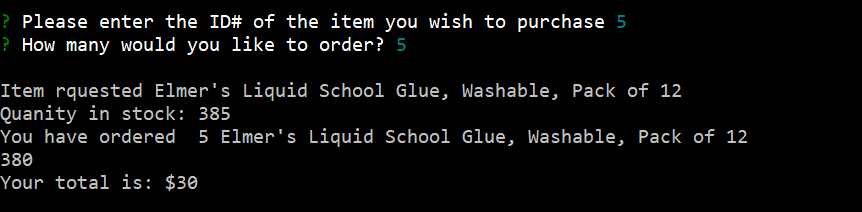
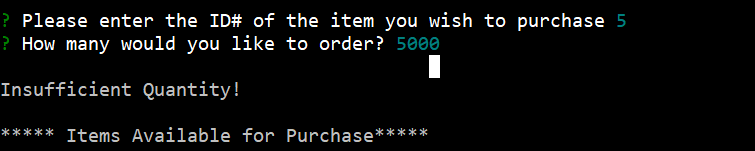

# Bamazon
This is command line program lets users view the inventory and an submit order by entering the item number from a fictional store named Bamazon. Once the item number is entered the invenventory checked and if the number of items is greater than the amount being requsted the inventory in the database will be updated.  This program utilizes Javascript for the user interface/logic, and MySql for the database.

## Installation instructions

Clone the repo to your computer and spin up the virtual machine.   Once you are SSH'd into the machine, bamazonCustomer.js file run the /var/code folder. If no data is found it may be necessary to to create the product table using the product.sql file.

## Application Flow

When the app loads it displays the list of available items, their item IDs and their price.

After the item information is shown the user is prompted to enter the item id of the item they wish to puchase and the quanity they wish to purchase.

If the requested quantity is in stock the order is confirmed and the database willbe updated behind the scenes.

If the quanity requested exceeds the inventory users will receive an insufficient quantity error.

    
